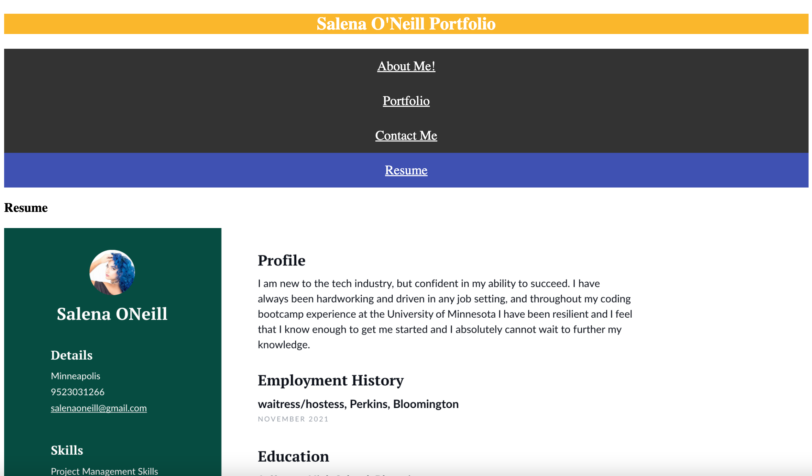

# react-portfolio

## Description

I built this single-page application to showcase my abilities using React as a potential employee! This greatly helped me to practice using and learn more about React. 

## Installation

1. Open your project directory and `npm install` to install packages.
2. `npm start` to run application in development mode.

## Usage

Click on About Me, Contact, Portfolio, and Resume sections to navigate the application.

## License

This application is covered by an MIT license.
